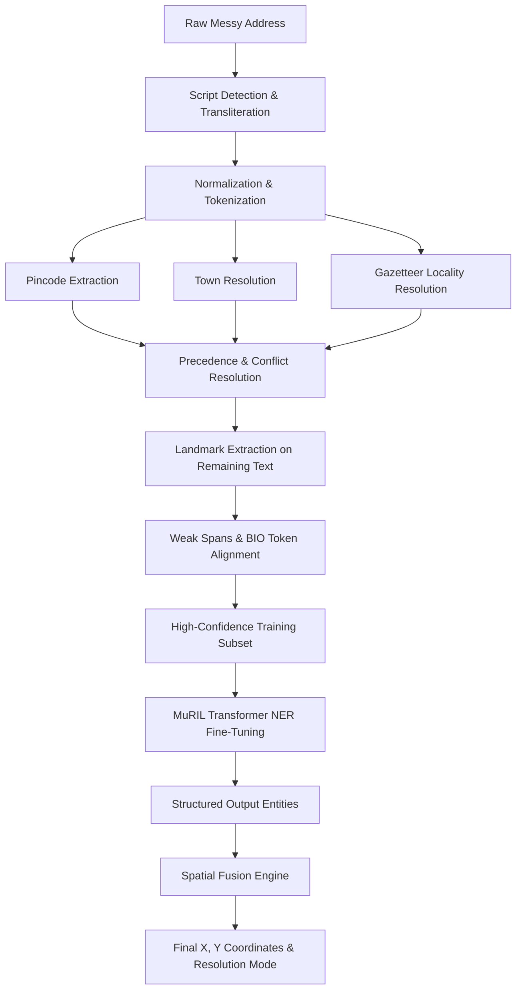

# Indian Address NER & Spatial Geocoding Pipeline

A high-precision weak-supervision and Transformer NER pipeline specifically engineered for unstructured, multi-script, and messy Indian addresses, integrated with a spatial geocoding fusion engine for exact coordinate resolution.

---

## 1. Project Philosophy & Core Objective

In messy Indian address parsing, heuristic rule-based systems hit diminishing returns due to unstructured syntax, colloquial variations, missing tokens, and transliteration noise. Training a deep neural model requires rich supervision, which is achieved through a multi-stage architecture:

$$\text{Deterministic Parser} \xrightarrow{\text{Weak Labels}} \text{MuRIL Transformer NER} \xrightarrow{\text{Spatial Fusion}} \text{Coordinates (X, Y)}$$

* **The Deterministic Parser is the Teacher**: Prioritizes precision over recall. Never guesses when evidence is weak. Ambiguous or low-confidence spans are left unlabelled.
* **The Transformer NER Model is the Generalizer**: Trained on strictly high-confidence silver labels to learn contextual syntax and generalize to unseen localities, informal abbreviations, and novel layouts.
* **The Fusion Engine is the Spatial Grounding**: Cross-references extracted entities against authoritative geospatial databases to resolve exact X/Y coordinates, dynamically handling multi-candidate POI dispersion for ambiguous landmarks.

---

## 2. Supported Entity Classes

| Entity | Description | BIO Tags |
| --- | --- | --- |
| `HOUSE_NUMBER` | Flat, plot, door, slash, or prefixed house identifier | `B-HOUSE_NUMBER`, `I-HOUSE_NUMBER` |
| `STREET` | Cross, Main, Road, Gali, Lane, and street ordinals | `B-STREET`, `I-STREET` |
| `WARD` | Municipal administrative ward designators | `B-WARD`, `I-WARD` |
| `LANDMARK` | Points of interest, temples, schools, tanks, relational cues | `B-LANDMARK`, `I-LANDMARK` |
| `LOCALITY` | Neighborhood, layout, enclave, or colony | `B-LOCALITY`, `I-LOCALITY` |
| `TOWN` | Authoritative city or municipal town | `B-TOWN`, `I-TOWN` |
| `PINCODE` | Exactly six-digit postal code | `B-PINCODE`, `I-PINCODE` |
| `O` | Outside / unallocated tokens / punctuation | `O` |

---

## 3. Modular Architecture

```text
address_parser/
├── data/
│   ├── addresses.csv           # Immutable raw address inputs
│   ├── towns.csv               # Authoritative town gazetteer
│   ├── localities.csv          # Town-scoped locality gazetteer
│   └── landmarks_poi.csv       # Spatial coordinate database for POIs
├── src/
│   ├── config.py               # Paths, entity classes, BIO labels, thresholds
│   ├── transliteration.py      # Indic scripts (Kannada, Devanagari) to Latin mapping
│   ├── normalization.py        # Text & abbreviation normalization
│   ├── pincode.py              # 6-digit pincode extraction & town verification
│   ├── town.py                 # Authoritative town resolver & span finder
│   ├── locality.py             # Gazetteer locality resolver with fuzzy checks
│   ├── landmark.py             # POIs & multilingual contextual indicators
│   ├── parser.py               # Master coordinator & conflict resolution
│   ├── weak_labels.py          # Weak span & token label dataset generator
│   ├── bio.py                  # Tokenization & BIO label alignment
│   ├── main.py                 # Master execution pipeline
│   ├── train_ner.py            # MuRIL fine-tuning pipeline
│   ├── inference.py            # Base inference CLI for NER tags
│   ├── fusion.py               # Spatial fusion engine for exact X, Y coordinate mapping
│   └── predict.py              # End-to-end interactive NER and Geocoding API
├── tests/
│   └── (Unit test modules for components)
└── outputs/
    ├── parsed_addresses.csv    # Parsed structured addresses
    ├── bio_dataset.csv         # Sequence-level BIO dataset for Transformer NER
    └── parser_statistics.json  # Comprehensive coverage and quality statistics

```

---

## 4. Pipeline Execution Workflow



---

## 5. How to Run Everything

### Step 1: Run Automated Unit Tests

```bash
python -m pytest tests/ -v

```

### Step 2: Run the Weak-Supervision Parser Pipeline

Generates parsed CSVs, weak label datasets, BIO training data, and statistical reports:

```bash
python -m src.main

```

### Step 3: Train the MuRIL NER Model

Trains the transformer on the high-confidence weak supervision dataset with group-stratified splits:

```bash
python -m src.train_ner

```

### Step 4: Interactive Geocoding & NER Prediction (Recommended)

Run the unified prediction script that combines NER extraction with spatial coordinate retrieval.

*Note: For Windows PowerShell, ensure UTF-8 encoding is enabled for native script support by running `[console]::InputEncoding = [console]::OutputEncoding = New-Object System.Text.UTF8Encoding` first.*

```bash
python predict.py

```

### Step 5: Python API Usage

You can integrate the full engine directly into other Python scripts:

```python
from src.predict import predict

result = predict("No. 124, Gali no-3, डाकघर के पास, Shivaji Nagar, Devgarh Ngr - 970202")

print(f"Town: {result['town_name']}")
print(f"Locality: {result['locality_name']} (X: {result['locality_x']}, Y: {result['locality_y']})")

for lm in result['landmarks']:
    print(f"Landmark: {lm['landmark_name']} ({lm['landmark_type']})")
    print(f"Relation: {lm['relation']} | X: {lm['poi_x']}, Y: {lm['poi_y']}")
    print(f"Resolution Mode: {lm['resolution_mode']}")

```

---

## 6. Systematic Improvements Over Baseline

| Metric | Baseline Prototype | Our Pipeline | Improvement |
| --- | --- | --- | --- |
| **Total T1/T2/T3 Addresses** | 2,880 | 2,880 | Benchmark subset |
| **Valid Pincodes** | 2,670 | 2,670 | 100% precision isolated 6-digit match |
| **Resolved Localities** | 2,415 | 2,598 | **+183 (+7.6%)** |
| **Unresolved Localities** | 465 | 282 | **-39.4% reduction in unparsed** |
| **House Numbers Extracted** | 1,173 | 1,962 | **+789 (+67.3%)** |
| **Streets Extracted** | 1,694 (Street/Ward) | 2,398 | **+41.6% coverage** |
| **Wards Extracted** | Included above | 240 | Dedicated extraction |
| **Landmarks Extracted** | 1,658 | 2,016 | **+358 (+21.6%)** |
| **Total Labeled Spans** | - | 15,416 | Multi-span coverage |
| **High-Confidence Tokens** | - | 49,363 | Silver training set |

## 7. Final Predictions 

Made final predictions on all datapoints of landmark coordinates, locality coordinates and town. Those addresses which has landmark missing were imputed with the nearest landmark to baseline_genencode coordinates
