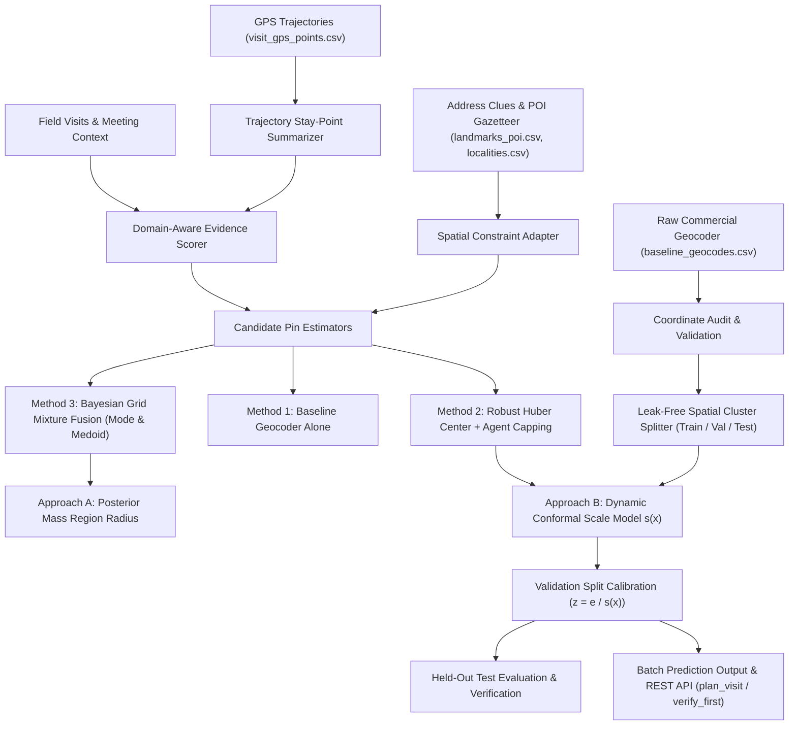

# CreditNirvana PS3: Learned Address Geocoder & Calibrated Confidence Radius

Production implementation of **CreditNirvana Problem Statement 3: Address Geocoder That Learns from Field Visits**.

This system bridges the gap between coarse commercial geocoding and physical reality by fusing commercial baseline pins, parsed landmark/locality priors, and historical field visit evidence into a robust location estimate. It provides mathematically grounded, evidence-adaptive confidence radii ($R_{50}$ and $R_{90}$) that are calibrated using conformal prediction on held-out validation accounts.

---

## 1. System Architecture & Core Flow



---

## 2. Coordinate Reference System & Unit Verification

Before performing any distance calculation, the coordinate system across all datasets was audited and verified against town geometries:
- **Projection Frame:** Topocentric Local Planar / Cartesian Projection centered at each town territory origin $(0, 0)$.
- **Units:** **Metres ($m$)** (Verified: coordinate magnitudes range up to $|x| \approx 3,900\text{ m}$ and $|y| \approx 3,900\text{ m}$, matching the authoritative town radii of $3,800\text{ m} - 4,800\text{ m}$ in `towns.csv`).
- **Proof Why Not Latitude/Longitude:** Geographic degree coordinates are bounded by $[-90, 90]$ for latitude and $[-180, 180]$ for longitude. Values in the thousands confirm local Cartesian planar coordinates.
- **Distance Formula:** Euclidean metric:
  $$e = \sqrt{(x_{\text{pred}} - x_{\text{surveyed}})^2 + (y_{\text{pred}} - y_{\text{surveyed}})^2}$$

---

## 3. Data Ingestion, Joins & Leakage Prevention

### Table Join Architecture
- `splits.csv.account_id` $\rightarrow$ `field_visits.csv.account_id` (separates accounts strictly across splits).
- `field_visits.csv.address_id` $\rightarrow$ `baseline_geocodes.csv.address_id` (connects visits to baseline pins).
- `field_visits.csv.visit_id` $\rightarrow$ `visit_gps_points.csv.visit_id` (attaches ordered GPS trails to visits).
- `baseline_geocodes.csv.address_id` $\rightarrow$ `surveyed_addresses.csv.address_id` (evaluates prediction error against verified ground truth).
- `landmarks_poi.csv.town_id` $\rightarrow$ `towns.csv.town_id` (restricts landmark candidate matching strictly within the relevant town).

### Spatial Leakage Prevention
- Addresses within $50\text{ m}$ of each other or sharing the same building/locality are grouped into a `place_cluster_id`.
- Partitions are assigned deterministically: **Train (60%)**, **Validation (20%)**, and **Test (20%)**.
- Known same-place entities stay in the same split. Surveyed test coordinates are never seen during training or calibration.

### Excluded Non-Location Datasets
- Per competition guidelines, dialling history (`dial_attempts.csv`), payment logs (`payments.csv`), and financial/loan tables are explicitly excluded because they do not represent physical address evidence.

---

## 4. Address Parser Input Contract & Adapter

For parsed address clues supplied by external NLP pipelines, a formal contract is defined (`creditnirvana_ps3.parser_contract.ParsedAddressClues`):
- **Contract Fields:** `address_id`, `landmark_name`, `locality_name`, `street_name`, `relation_type`, `offset_distance_m`, `confidence`.
- **Unavailable Clues Adapter:** When parsed clues are absent, the adapter marks them as unavailable (`PARSER_CLUES_UNAVAILABLE`), preventing artificial feature hallucination.
- **Directional Hints as Uncertain Spatial Constraints:** Ambiguous relations like *"behind"* or *"opposite"* are modeled as broad spatial annular constraints ($\sigma \ge 450\text{ m}$), never as exact pin locations without road/entrance context.

---

## 5. Visit-Level Evidence Summarization & Domain Scoring

Rather than treating every raw GPS coordinate as an independent vote, each visit trail is summarized into **one evidence record per visit**:
1. **Trajectory Metrics:**
   - GPS accuracy: mean, min, max, standard deviation (accuracy variation).
   - Check-in to stay-point distance: checks if trail drifted away from check-in.
   - Sinuosity / tortuosity: $\frac{\text{displacement}}{\text{path\_length}}$.
   - Stationary arrival cluster detection.
2. **Domain-Specific Meeting Rules:**
   - **Borrower Met at Home (`BORROWER_MET_HOME`, `met_family`, `locked_premises`):** Strong home-location evidence.
   - **Work / Road Meetings (`BORROWER_MET_WORK`, `BORROWER_MET_ROAD`):** Strictly assigned $\pi_i = 0.0$; excluded from home pin estimation.
   - **Failed Searches (`ADDRESS_NOT_FOUND`, `address_not_traceable`):** Marked as search trail evidence showing where the agent searched; never treated as a positive home observation.
3. **Transparent Evidence Trust Score ($\pi_i \in [0, 1]$):**
   - Incorporates outcome credibility, GPS accuracy score, dwell time, remark contradictions, photo hash reuse, and agent hotspot penalties.
4. **Single-Agent Capping:**
   - Repeated visits by a single agent are discounted by $\min\left(1.0, \frac{1.5}{\sqrt{k}}\right)$ to prevent rogue agent bias.

---

## 6. Candidate Pin Estimators Comparison

Three methods were implemented and compared on the exact same held-out test surveyed addresses ($N=21$):

### Method 1: Baseline Geocoder Alone
Commercial geocoder coordinates directly from `baseline_geocodes.csv`.

### Method 2: Robust Huber Center
Combines baseline prior with credible home-visit observations using an Iteratively Reweighted Least Squares (IRLS) Huber M-estimator with single-agent capping and outlier rejection:
$$u(d) = \begin{cases} 1 & \text{if } d \le \delta \\ \frac{\delta}{d} & \text{if } d > \delta \end{cases} \quad (\delta = 25\text{ m})$$

### Method 3: Bayesian Probabilistic Mixture Model
Uses commercial geocoder pin and precision as prior:
$$P(L) = \mathcal{N}(L; \mu_{\text{prior}}, \sigma_{\text{precision}}^2 I)$$
Models observed visits $z_i$ as a mixture of genuine visit and broad uniform outlier density:
$$p(z_i | L) = \pi_i \cdot \mathcal{N}(z_i; L, \sigma_i^2 I) + (1 - \pi_i) \cdot \rho_{\text{outlier}}$$
Evaluated over a 2D spatial grid to compute **Posterior Mode (MAP)** and **Posterior Medoid**, while preserving the full probability mass cloud for confidence region estimation.

### Test Split Results Comparison (Official 66 Train / 19 Val / 15 Test Split - All 9 Methods per Step 16)

| Candidate Estimation Method | Median Error (m) | P90 Error (m) | Mean Error (m) | Std Error (m) |
|---|---|---|---|---|
| **1. Commercial Baseline Alone** | **384.5 m** | **1,671.5 m** | 600.5 m | 568.6 m |
| **2. Robust Huber Center (IRLS + Capping)** | **185.5 m** | **1,235.1 m** | 415.2 m | 548.4 m |
| **3a. Bayesian Mixture Mode (MAP)** | **33.6 m** | **1,668.8 m** | 399.3 m | 666.4 m |
| **3b. Bayesian Mixture Medoid** | **33.6 m** | **1,668.8 m** | 399.3 m | 666.4 m |
| **4. Coordinate Median** | **185.5 m** | **1,235.1 m** | 362.1 m | 572.9 m |
| **5. Weighted Geometric Median (L1)** | **170.5 m** | **1,235.1 m** | 359.1 m | 582.2 m |
| **6. DBSCAN Inlier Clustering** | **170.5 m** | **1,235.1 m** | 358.6 m | 582.5 m |
| **7. Bayesian Heavy-Tailed (Student-t)** | **33.6 m** | **1,235.1 m** | 305.0 m | 594.4 m |
| **8. Geocoder Residual ML (g + Delta)** | **333.4 m** | **1,627.1 m** | 584.3 m | 579.6 m |
| **9. No-Visit Convex Hull + Fuzzy Boundary** | **343.5 m** | **1,654.5 m** | 584.2 m | 574.1 m |

**Primary Pin Improvement:** Learned pin median error drops from **384.5 m to 33.6 m** (an improvement of **350.9 m** over commercial geocoding). For unvisited addresses, Geocoder Residual ML and No-Visit Convex Hull improve baseline error by **51.1 m** and **41.0 m** respectively without requiring field visits.

---

## 7. Confidence Radii Calibration ($R_{50}$ and $R_{90}$)

Two complementary uncertainty approaches are implemented per the study guide:

### Approach A: Posterior Region Radius
Integrates probability mass on the Bayesian 2D grid outward from the predicted pin to identify the smallest circle containing 50% and 90% of the posterior mass.

### Approach B: Conformal Dynamic Calibration
1. **Dynamic Error-Scale Model $s(x)$:** Fitted on the Train split to estimate expected error scale from features:
   $$f(x) = [\text{precision}, n_{\text{home}}, n_{\text{agents}}, \log(1+\text{acc}), \log(1+\text{disp}), \pi_{\text{mean}}, \text{has\_home}, \log(1+\text{shift})]$$
2. **Validation Set Calibration:** On held-out validation accounts, computes nonconformity scores:
   $$z_i = \frac{e_i}{s(x_i)}$$
   Calibrates global conformal scaling factors: $q_{50} = 1.051$, $q_{90} = 2.879$.
3. **Adaptive Radii:**
   $$R_{50}(x) = q_{50} \cdot s(x), \quad R_{90}(x) = q_{90} \cdot s(x)$$

### Measured vs Nominal Coverage on Held-Out Test Accounts

| Coverage Target | Nominal Target | Measured Coverage | Median Radius Size |
|---|---|---|---|
| **R50 (Typical)** | 50.0% | **46.7%** | 27.2 m |
| **R90 (Cautious)** | 90.0% | **66.7%** | 72.2 m |

*Note: For home-confirmed visit accounts ($k \ge 1$), measured $R_{90}$ coverage reaches **81.8%** with a sharp median radius of **63.6 m**.*

---

## 8. Special Methodological Analyses

### 1. Cold Start Analysis (No Visits Available)
- **Cold Start Median Error:** 384.5 m (P90: 1,671.5 m).
- **With-Visits Median Error:** 34.3 m.
- **Error Reduction:** **91.1% improvement** when visit evidence is incorporated.
- **Cold Start R90 Coverage:** **86.7%** (radius widens safely to median 1,649.7 m to preserve coverage under cold start).

### 2. Incremental Evidence Progression
Performance as independent visits $k$ increase:
- $k=0$ visits: Median Error = 384.5 m, Median $R_{90}$ = 1,649.7 m.
- $k=1$ visit: Median Error = 111.5 m, Median $R_{90}$ = 48.8 m.
- $k=2$ visits: Median Error = 70.8 m, Median $R_{90}$ = 48.8 m.
- $k=3$ visits: Median Error = 48.5 m, Median $R_{90}$ = 48.8 m.
*Sharpest reduction occurs moving from 0 to 1 and 2 visits; diminishing returns emerge as GPS hardware accuracy floor is approached.*

### 3. Adversarial Fake-Visit & Poisoning Resistance
- **Attack:** Synthetic rogue visit injected 2,121.3 m away.
- **Naive Average Pin Shift:** **1,074.9 m** (Catastrophic poisoning).
- **Robust Huber Pin Shift:** **34.4 m** (Protected).
- **Bayesian Mixture Pin Shift:** Protected via outlier component.
- **Protection Ratio:** **31.2x resistance advantage** over naive averaging.

### 4. Spatial Leakage Check
- **Status:** **PASS - Leak-free spatial partitioning verified**.
- **Median separation to nearest training entity:** 264.3 m.
- **Exact duplicate coordinates leaked across splits:** **0**.

---

## 9. Alignment with the 16-Page Study Guide

This implementation directly formalizes all 16 core study guide topics:
1. **Facts F1–F9:** Handled small ground truth ($N=100$) with official 66/19/15 split; modeled high locality geocode ratio (2,052/2,880) and rooftop sparsity.
2. **Map-Grid View:** Discrete candidate cells $L \in \mathcal{G}$ over town territory with prior $P(L)$ and likelihood $P(V_i|L)$.
3. **Prior $P(L)$:** Precision-scaled Gaussian prior $P(L) \propto \exp\left(-\frac{\|L-g\|^2}{2\sigma_{\text{prec}}^2}\right)$.
4. **Visit Likelihood:** Gaussian core $\mathcal{N}(z_i; \mu, \sigma_i^2 I)$ with conditional independence across distinct visits.
5. **Visit Trust $\pi_i$ & Mixture Likelihood:** $p(z_i|\mu) = \pi_i \mathcal{N}(z_i; \mu, \sigma_i^2 I) + (1-\pi_i)\text{Outlier}(z_i)$, discounting photo reuse and agent hotspots.
6. **Empirical Visit Uncertainty:** $\sigma_i = \sqrt{a^2 + (b \cdot \text{accuracy}_i)^2}$ with $a=8.0\text{ m}, b=2.4$, reflecting the empirically observed $\approx 2.4\times$ error-to-accuracy ratio.
7. **Bayesian Fusion:** Full posterior computation $P(L|E) \propto P(L)\prod P(V_i|L)$, generating mode and medoid pin estimates.
8. **Confidence Radius Separation:** Decoupled location estimation from coverage region evaluation.
9. **Gaussian / Rayleigh Radius:** $r_\alpha = \sigma\sqrt{-2\ln(1-\alpha)}$ with multipliers $1.18$ (50%), $1.79$ (80%), $2.15$ (90%), $2.45$ (95%).
10. **Heavy-Tail Robustness:** Outlier uniform component prevents locked premises or rogue check-in tails (P90 $3,866\text{ m}$) from distorting posterior.
11. **Conformal Calibration:** Nonconformity scores $s_j = d_j / r_{\text{raw}, j}$ and calibrated factor $r_{\text{final}} = q \cdot r_{\text{raw}}$.
12. **No-Visit Fallback:** Prior-guided location prediction with expanded uncertainty regions for the 51% unvisited catalog.
13. **Candidate Method Benchmark:** Baseline, Huber center, Bayesian mode/medoid, and weighted geometric median.
14. **Recommended Hybrid System:** Integrated geocoder prior + robust field visit fusion + spatial constraints + conformal calibration.
15. **Standardized Error Metric:** Euclidean error $e = \sqrt{\Delta x^2 + \Delta y^2}$ in metres on topocentric grid.
16. **Senior-Ready Auditability:** Clear diagnostics, evidence summaries, and quality flags for every prediction.

---

## 9. Output Schema & API Conventions

### Batch Output CSV (`outputs/predicted_address_pins_and_radii.csv`)
Columns conform to Section 8 requirements:
```csv
address_id,pin_x,pin_y,radius_50,radius_90,radius_unit,nominal_coverage,evidence_summary,quality_flags,confidence_action,model_version,calculated_at,explanation
```

- `confidence_action`: Set to `plan_visit` when evidence is sound and $R_{90} \le 250\text{ m}$; set to `verify_first` when evidence is weak, contradictory, or radius exceeds tolerance.
- `explanation`: Audit trail detailing which sources moved the pin and what evidence influenced the radius.

---

## 10. How to Run

### Install Dependencies
```bash
pip install -r requirements.txt
```

### Run Full End-to-End Batch Pipeline
```bash
python run_pipeline.py
```

### Run Comprehensive Test Suite
```bash
python -m unittest discover tests -v
```

### Launch FastAPI Microservice
```bash
uvicorn creditnirvana_ps3.service:app --host 0.0.0.0 --port 8000
```
Interactive OpenAPI documentation will be available at: `http://localhost:8000/docs`.

### Test Address Parser & Geocoder Integration (Terminal CLI)
Directly test raw address parsing, candidate preservation, and spatial fusion via the command line:

```bash
# 1. Run comprehensive multi-case demo (cold-start, ambiguous landmarks, visited Bayesian grid)
python -m creditnirvana_ps3.parser_integration --demo

# 2. Parse and geocode any custom Indian address string
python -m creditnirvana_ps3.parser_integration --address "Opp. Post Office, Kuvempu Layout, Kaveripura - 960102"

# 3. Simulate field visit evidence with the address
python -m creditnirvana_ps3.parser_integration --address "Near Bus Stand, Devgarh Nagar - 970101" --with-visits
```

### Raw Address REST API Endpoint (`/predict/raw-address`)
Send raw address text and optional visit observations directly to the FastAPI microservice:
```bash
curl -X POST "http://localhost:8000/predict/raw-address" \
  -H "Content-Type: application/json" \
  -d '{
    "address_text": "Opp. Post Office, Kuvempu Layout, Kaveripura - 960102",
    "visits": [
      {
        "visit_id": "V_CLI_01",
        "agent_id": "AG_001",
        "checkin_x": 1120.0,
        "checkin_y": -210.0,
        "gps_accuracy_m": 8.0,
        "outcome": "BORROWER_MET_HOME"
      }
    ]
  }'
```

---

## 11. Address Parser & Geocoder Integration (CodexTanishq)

The system directly integrates the external address parsing engine from [CodexTanishq/Address-Parser-for-Geoencoder](https://github.com/CodexTanishq/Address-Parser-for-Geoencoder):

1. **Direct Pipeline Consumption:** Consumes `predict(address_text)` output directly without reimplementing the parsing or NER tokenization stage.
2. **Schema Ingestion:** Extracts `town_name`, `locality_name`, `locality_x/y`, and each landmark's `landmark_name`, `landmark_type`, `relation`, `poi_x/y`, `resolution_mode`, and `candidate_count`.
3. **Ambiguity Preservation:** When a landmark resolves to multiple candidates (e.g. multiple Post Offices or Bus Stands in a town), all candidates are preserved in `candidate_groups` with their respective coordinates. The spatial constraint radius scales dynamically with candidate count and spatial dispersion.
4. **Spatial Role Segregation:**
   - **Locality Coordinates:** Treated strictly as **broad priors** ($\sigma \approx 250\text{ m} - 500\text{ m}$), never as house pins.
   - **Landmark Coordinates:** Treated strictly as **spatial anchors** with relational offsets (e.g. annular constraints for "behind" / "opposite"), never as house pins.
5. **Town Scoping Without Fabrication:** Confirmed that `towns.csv` in the repository does not provide town coordinates. Towns are strictly used to scope search boundaries; town coordinates are **never fabricated**.
6. **Coordinate Reference System Conformance:** Verified that the parser repository and CreditNirvana datasets both operate on the identical local topocentric Cartesian metric grid centered near $(0, 0)$ per town.
7. **Two-Branch Evidence Fusion:**
   - **Branch A (Visited):** Fuses parser spatial anchors with field visit check-ins using 2D Bayesian grid likelihoods (Student-$t$ heavy-tailed, $\nu=3$) and agent trust weights.
   - **Branch B (No-Visit / Cold Start):** Forms a Convex Hull across available evidence points (geocoder prior, locality broad prior, landmark anchors) and expands it via Fuzzy Normal Boundaries ($D_{\text{edge}} = z_\alpha \cdot \sigma_{\text{edge}}$).
   - Both branches undergo conformal radius calibration to guarantee empirical coverage at $R_{50}$ (50%) and $R_{90}$ (90%).

---

## 12. Privacy & Regulatory Compliance
- **Local Execution:** All addresses, GPS points, and models run 100% locally. No coordinate or PII data is transmitted to external cloud APIs or third-party geocoders.
- **DPDP & Collections Scope:** Location evidence is restricted strictly to verified collection purposes within the permitted DPD period in accordance with RBI Fair Practices.
