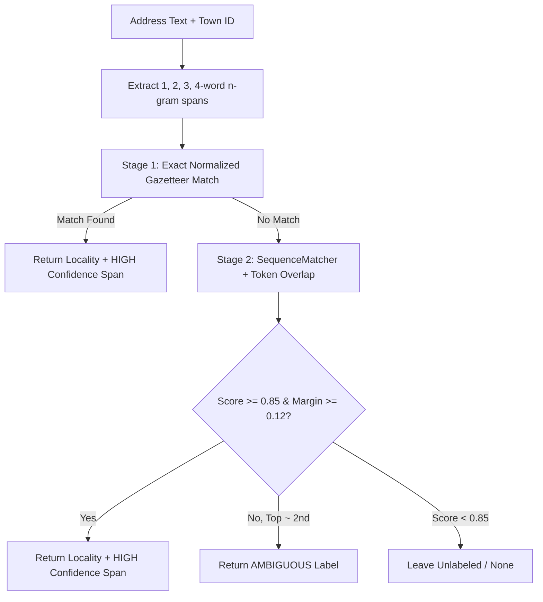

# Technical Engineering & ML Report: Weak-Supervision Indian Address NER Pipeline

**Project:** Indian Address Named Entity Recognition (NER) via High-Precision Weak Supervision and MuRIL Fine-Tuning  
**Date:** October 2026  
**Role:** Senior ML/NLP Engineer & Systems Architect  
**Status:** Validated Pipeline, Checkpointed Model, Stress-Tested on Real-World Addresses  

---

## Executive Summary

Unstructured Indian postal addresses represent one of the most challenging frontiers in information extraction. Unlike standardized Western addresses governed by strict tabular schemas (e.g., Street Number, Street Name, City, State, ZIP), Indian addresses are characterized by non-standardized ordering, colloquial navigational landmarks, multi-script mixtures (Devanagari, Kannada, Latin), heavy phonetic abbreviations (`ngr`, `layt`, `colny`), unstructured house numbering schemes (`#81`, `217/2`, `H.No. 356`), and frequent omission of key administrative entities.

The primary objective of this project is to build an end-to-end, production-grade weak-supervision and deep token classification pipeline:
1. **The Deterministic Parser (Teacher):** A modular, rule-based, gazetteer-driven parser engineered strictly to prioritize **precision over recall**. The parser extracts verifiable postal entities (`PINCODE`, `TOWN`, `LOCALITY`, `HOUSE_NUMBER`, `STREET`, `WARD`, `LANDMARK`), performs transliteration-aware span matching, resolves conflicts via strict precedence masking, and leaves uncertain or ambiguous spans unlabelled rather than hallucinating noisy boundaries.
2. **Weak / Silver Label Generation:** The deterministic parser annotates the raw addresses into token-level BIO sequences (`B-`, `I-`, `O`). High-confidence records are filtered to create a silver training dataset.
3. **The Transformer NER Model (Generalizer):** A fine-tuned Multilingual Representations for Indian Languages (**MuRIL**) model (`google/muril-base-cased`), trained on high-confidence weak labels using leakage-free group-stratified splits. The deep model learns broader contextual syntactic cues, enabling it to generalize beyond the static gazetteer and parse unseen towns, informal phrasing, and novel layout naming conventions.

### Critical Evaluative Distinction
- **Parser Coverage & Statistics:** Measure the percentage of addresses where deterministic evidence is sufficient to extract an entity without guessing.
- **Weak / Silver Labels:** Automated silver annotations generated by the teacher parser; they are **not human-annotated ground truth**.
- **Model Evaluation Metrics:** Measure agreement between MuRIL predictions and the held-out silver labels generated by the teacher parser ($F_1 = 0.9717$ Micro Average on the held-out test split). They do **not** reflect accuracy against manually curated ground truth.
- **Qualitative Stress Testing:** End-to-end inference over diverse edge cases (Kannada, Devanagari, slash house numbers, misspelled localities, and external pan-Indian addresses).

---

## Table of Contents
1. [Dataset Overview & Ingestion Analysis](#1-dataset-overview--ingestion-analysis)
2. [Address Data Characteristics & Pattern Quantification](#2-address-data-characteristics--pattern-quantification)
3. [Multilingual & Multi-Script Architecture](#3-multilingual--multi-script-architecture)
4. [Text Normalization Subsystem](#4-text-normalization-subsystem)
5. [Deterministic Pincode Extraction](#5-deterministic-pincode-extraction)
6. [Authoritative Town Resolution](#6-authoritative-town-resolution)
7. [Gazetteer Locality Resolution](#7-gazetteer-locality-resolution)
8. [House Number Extraction](#8-house-number-extraction)
9. [Street & Ward Extraction](#9-street--ward-extraction)
10. [Landmark & POI Extraction Subsystem](#10-landmark--poi-extraction-subsystem)
11. [Master Parser Architecture & Conflict Resolution](#11-master-parser-architecture--conflict-resolution)
12. [Weak Supervision & Silver Label Generation](#12-weak-supervision--silver-label-generation)
13. [BIO Sequence Alignment & Dataset Creation](#13-bio-sequence-alignment--dataset-creation)
14. [Quality Control, Validation & Test Suite](#14-quality-control-validation--test-suite)
15. [Deterministic Parser Benchmark Performance](#15-deterministic-parser-benchmark-performance)
16. [MuRIL Transformer Model Training](#16-muril-transformer-model-training)
17. [MuRIL Quantitative Evaluation (Against Silver Labels)](#17-muril-quantitative-evaluation-against-silver-labels)
18. [Live Inference & Generalization Experiments](#18-live-inference--generalization-experiments)
19. [Comprehensive Error Analysis](#19-comprehensive-error-analysis)
20. [System Limitations & Known Boundaries](#20-system-limitations--known-boundaries)
21. [Current System Status & Verification](#21-current-system-status--verification)
22. [Prioritized Engineering Roadmap](#22-prioritized-engineering-roadmap)

---

## 1. Dataset Overview & Ingestion Analysis

The project ingests three raw CSV files located in `data/`, treated as immutable ground data:
- `addresses.csv`: Primary raw address corpus ($3,117$ rows).
- `towns.csv`: Authoritative town gazetteer ($3$ towns).
- `localities.csv`: Gazetteered localities mapped to specific towns and PIN codes ($36$ localities).

### Schema Definitions & Data Types

| File | Column Name | Data Type | Null Count | Semantic Description |
| :--- | :--- | :--- | :--- | :--- |
| `addresses.csv` | `address_id` | `object` (string) | 0 | Unique surrogate identifier (e.g., `AD000001`) |
| | `account_id` | `object` (string) | 0 | Customer/account reference |
| | `address_type` | `object` (string) | 0 | Delivery type categorization |
| | `source` | `object` (string) | 0 | Channel/origin log |
| | `added_date` | `object` (string) | 0 | Timestamp of record insertion |
| | `town_id` | `object` (string) | 0 | Administrative identifier (`T1`, `T2`, `T3`, or `OUT`) |
| | `address_text` | `object` (string) | 0 | Raw, unnormalized address string |
| `towns.csv` | `town_id` | `object` (string) | 0 | Town code (`T1`, `T2`, `T3`) |
| | `town_name` | `object` (string) | 0 | Authoritative English name |
| | `address_style` | `object` (string) | 0 | Layout typology (`karnataka`, `hindi`, `metro`) |
| | `approx_radius_m`| `int64` | 0 | Approximate geographical radius (meters) |
| `localities.csv`| `locality_id` | `object` (string) | 0 | Locality code (e.g., `T1-L01`) |
| | `town_id` | `object` (string) | 0 | Foreign key matching `towns.csv` |
| | `locality_name` | `object` (string) | 0 | Canonical English locality name |
| | `pincode` | `int64` | 0 | Canonical 6-digit postal code |
| | `centroid_x` | `float64` | 0 | Local coordinate X centroid |
| | `centroid_y` | `float64` | 0 | Local coordinate Y centroid |

### Administrative Distributions & Benchmark Subset

Of the $3,117$ addresses in `addresses.csv`, the benchmark evaluation focuses on the $2,880$ addresses belonging to towns `T1`, `T2`, and `T3`. The remaining $237$ addresses belong to `town_id = OUT` (rural addresses formatted as `Village ..., Tehsil ..., District ...`).

```
addresses.csv Total Records: 3,117
├── T1 (Kaveripura - Karnataka style):     942 (30.22%)
├── T2 (Devgarh Nagar - Hindi style):       952 (30.54%)
├── T3 (Navanagara East - Metro style):    986 (31.63%)
└── OUT (Out-of-scope Rural / Other):      237  (7.60%)
    Total Benchmark Subset (T1+T2+T3):   2,880 (92.40%)
```

### Gazetteer Localities per Town

The gazetteer `localities.csv` contains exactly $12$ localities for each of the three benchmark towns:
- **Town T1 (`Kaveripura`):** Vinayaka Nagar, Basava Nagar, Kuvempu Layout, Gandhi Nagar, Ashoka Layout, Siddeshwara Colony, Anjaneya Badavane, Vidya Nagar, Shanthi Nagar, Kalyana Nagar, Nehru Colony, Hosa Badavane.
- **Town T2 (`Devgarh Nagar`):** Shivaji Nagar, Indira Colony, Ambedkar Nagar, Ram Nagar, Subhash Nagar, Nehru Colony, Gandhi Basti, Azad Mohalla, Shastri Nagar, Krishna Puri, Patel Nagar, Tilak Nagar.
- **Town T3 (`Navanagara East`):** Green Park Layout, Sunrise Enclave, HMT Colony, Defence Colony, Lakeview Phase 2, Silver Oak Layout, Railway Colony, Teachers Colony, Royal Gardens, Palm Meadows, Orchid Enclave, Unity Nagar.

### Duplicate Analysis
- **Unique `address_id`:** $2,880$ in benchmark ($3,117$ total); exactly $0$ duplicate IDs.
- **Duplicate `address_text`:** Exactly $3$ duplicate pairs ($6$ rows total) exist in the benchmark set:
  1. `Gali 12, Krishna Puri, Devgarh Nagar - 970202` (`AD001877` and `AD001944`)
  2. `gali no-10 azad mohalla devgarh nagar - 970203` (`AD000250` and `AD001830`)
  3. `railway colony navanagara east - 980304` (`AD001507` and `AD002939`)

### Character & Token Length Distributions

Calculated over the $2,880$ benchmark addresses:

| Metric | Character Length | Word / Token Count |
| :--- | :--- | :--- |
| **Count** | 2,880 | 2,880 |
| **Mean** | 68.14 | 16.29 |
| **Std Dev** | 13.82 | 4.09 |
| **Min** | 11 | 2 |
| **5th Percentile** | 44 | 10 |
| **25th Percentile** | 59 | 13 |
| **50th Percentile (Median)** | 69 | 16 |
| **75th Percentile** | 78 | 19 |
| **95th Percentile** | 89 | 23 |
| **99th Percentile** | 99 | 25 |
| **Max** | 113 | 29 |

---

## 2. Address Data Characteristics & Pattern Quantification

To design deterministic extraction rules with high precision, the benchmark corpus of $2,880$ addresses was scanned for syntactic patterns, prefixes, abbreviations, and noise.

### Syntactic Element Frequencies in Benchmark Corpus

| Element Category | Specific Pattern / Indicator | Matches (out of 2,880) | Prevalence (%) |
| :--- | :--- | :--- | :--- |
| **House Number** | `H.No.` / `HNo` / `H. No.` | 401 | 13.92% |
| | `House <num>` | 373 | 12.95% |
| | `No. <num>` / `No <num>` | 973 | 33.78% |
| | `#<num>` (Hash prefix) | 399 | 13.85% |
| | Standalone slash (`217/2`, `367/3`, `89/2`) | 383 | 13.30% |
| **Street Components** | `Cross` / `Crs` / `Cr` | 683 | 23.72% |
| | `X` shorthand for Cross (`6th X`) | 63 | 2.19% |
| | `Main` / `Mn` | 761 | 26.42% |
| | `Road` / `Rd` | 978 | 33.96% |
| | `Gali` / `गली` | 702 | 24.38% |
| **Administrative Units** | `Ward <num>` / `Ward No. <num>` | 240 | 8.33% |
| | `Block` / `Blk` | 844 | 29.31% |
| **Relational Landmarks** | `near` / `nr.` / `nr` | 624 | 21.67% |
| | `opp` / `opp.` / `opposite` | 172 | 5.97% |
| | `behind` / `hinde` / `के पीछे` / `ke piche` | 99 | 3.44% |
| | `beside` / `pakka` / `के बगल` / `ke bagal` | 37 | 1.28% |
| | `close to` | 233 | 8.09% |
| | `ke paas` / `ke pass` / `के पास` | 329 | 11.42% |
| | `hattira` / `ಹತ್ತಿರ` | 241 | 8.37% |
| | `eduru` / `edurru` / `ಎದುರು` | 34 | 1.18% |
| **Common POIs** | Temple (`temple`, `mandir`, `gudi`, `devasthana`) | 346 | 12.01% |
| | School (`school`, `shaale`, `skula`, `स्कूल`) | 186 | 6.46% |
| | Medical (`medical store`, `pharmacy`, `dawai`) | 96 | 3.33% |
| | Water Tank (`water tank`, `tanki`, `overhead tank`)| 98 | 3.40% |
| | Ration / PDS (`pds shop`, `ration shop`, `nyayabele`)| 113 | 3.92% |
| **Locality Abbreviations** | `ngr` / `nagr` for Nagar | 511 | 17.74% |
| | `layt` / `layou` / `lyt` for Layout | 87 | 3.02% |
| | `col` / `colny` / `clny` for Colony | 236 | 8.19% |

### Key Noise Characteristics
1. **Multiple Number Tokens:** $1,373$ addresses contain $2$ numbers, $745$ contain $3$ numbers, and $193$ contain $4$ numbers. Without strict semantic parsing, an ordinal street number (e.g., `6th`) or ward number (e.g., `Ward 9`) can be conflated with a house number.
2. **Missing Administrative Layers:** $282$ addresses completely omit a locality entity, jumping directly from street/landmark to town (e.g., `house 25 3rd cross 6th main rd kaveripura - 960104`).
3. **Pincode / Locality Inconsistencies:** Certain addresses feature a PIN code differing from the gazetteered centroid code of the locality (e.g., Kuvempu Layout with `960104` instead of `960102`), which occurs in multi-postal ward zones.

---

## 3. Multilingual & Multi-Script Architecture

### Script Distribution
The benchmark addresses exhibit three distinct script combinations:
- **Pure Latin Script:** $2,855$ addresses ($91.59\%$).
- **Devanagari + Latin Mixed:** $154$ addresses ($4.94\%$), concentrated in Town `T2` (`Devgarh Nagar`).
- **Kannada + Latin Mixed:** $108$ addresses ($3.46\%$), concentrated in Town `T1` (`Kaveripura`, 81) and `T3` (`Navanagara East`, 27).
- **Other Indic Scripts:** Bengali, Gurmukhi, Gujarati, Oriya, Tamil, Telugu, and Malayalam were checked across `addresses.csv`. None appeared in the benchmark rows. However, transliteration support for all nine national scripts was implemented in `src/transliteration.py` to ensure pipeline robustness.

### Transliteration vs. Translation
The pipeline performs **script transliteration**, strictly avoiding semantic translation:
- Kannada `ಚರ್ಚ್ ಹತ್ತಿರ` transliterates to `charch hattira` (Latin phonetics). It is **not** translated to the English phrase `near church`.
- Hindi `मस्जिद के पास` transliterates to `masjida ke pasa`. It is **not** translated to `near mosque`.

Preserving phonetic transliteration maintains token boundaries and ensures consistency with Latin-script addresses that already use colloquial Romanized Hindustani or Kannada terms (`hattira`, `ke paas`).

### Bidirectional Span Interpolation
To evaluate token classifications on the original scripts while parsing in a normalized Latin space, `transliterate_with_mapping()` computes bidirectional character offsets:

```
Original:       "6th Cross, 5th Main, ಚರ್ಚ್ ಹತ್ತಿರ, Kuvempu Layt"
Transliterated: "6th Cross, 5th Main, charch hattira, Kuvempu Layt"
                 └───────────────┘    └────────────┘  └───────────┘
Exact match:      [0:20]              [21:35]         [37:49]
Indic mapping:    [21:26] (ಚರ್ಚ್)  <-> [21:27] (charch)
                  [27:33] (ಹತ್ತಿರ) <-> [28:35] (hattira)
```

Linear interpolation within matched contiguous chunks allows character-level bounding boxes detected in the transliterated string to be projected back to exact Unicode offsets in the raw address.

---

## 4. Text Normalization Subsystem

Normalization is separated into two operational tracks: **matching normalization** and **model input normalization**.

```
Raw Text: "197/1, 4TH CROSS, 8TH MAIN, KUVEMPU LAYT, KAVERIPURA - 960104"
    │
    ├── Model / Storage Normalization (src/normalization.py -> normalize_text)
    │   • Lowercasing
    │   • Unicode dash standardization (–, —, − to -)
    │   • Deduplication of repeated punctuation (,, to ,)
    │   • Preserves casing, slashes, numbers, tokens intact
    │   Output: "197/1, 4th cross, 8th main, kuvempu layt, kaveripura - 960104"
    │
    └── Matching Normalization (src/normalization.py -> normalize_for_matching)
        • Punctuation replaced with whitespace
        • Abbreviation expansion via gazetteer dictionary:
            layt / layou / lyt -> layout
            ngr / nagr / ngar  -> nagar
            colny / clny / col -> colony
            bdvne / badavne    -> badavane
            lakevew            -> lakeview
        Output: "197 1 4th cross 8th main kuvempu layout kaveripura 960104"
```

---

## 5. Deterministic Pincode Extraction

Indian postal PIN codes consist of six decimal digits. The regex implementation enforces strict non-digit boundaries:

```python
PINCODE_REGEX = re.compile(r"(?<!\d)(\d{6})(?!\d)")
```

### Precision Safeguards
1. **Ordinal Rejection:** Ordinals such as `6th` match a single digit followed by characters; they are excluded.
2. **Slash Fractions:** Formats like `217/2` contain 3 digits and 1 digit separated by a slash; neither is a 6-digit block.
3. **Invalid Digits:** Numbers with 5 digits (`96010`) or 7 digits (`1234567`) are rejected by lookaround boundaries. An intentional malformed test case in the corpus, `#159, 6th Cross, 7th Main, Anjaneya Badavane, Kaveripura - 9601003` ($7$ digits), yields `PINCODE = None`.
4. **Leading Zero Rejection:** Indian PIN codes range from $110001$ to $855117$ (plus experimental $9xxxxx$). Numbers starting with `0` are rejected.
5. **Cross-Reference Validation:** If the extracted PIN code matches the gazetteer for the record's `town_id`, confidence is scored as `HIGH`. If a 6-digit code exists but is absent from the town's gazetteer, confidence is scored as `MEDIUM`.
6. **Ambiguity Handling:** If an address contains multiple distinct 6-digit numbers, confidence is scored as `AMBIGUOUS` and withheld from automated weak labels.

### Extraction Results
- **Valid 6-digit PIN codes extracted:** $2,670$ ($92.71\%$ of benchmark addresses).
- **Missing / Malformed PIN codes:** $210$ ($7.29\%$).

---

## 6. Authoritative Town Resolution

The raw input file `addresses.csv` supplies `town_id` as an administrative metadata attribute:
- `T1` $\rightarrow$ `Kaveripura`
- `T2` $\rightarrow$ `Devgarh Nagar`
- `T3` $\rightarrow$ `Navanagara East`

### Implementation Strategy
Rather than performing unrestricted fuzzy string searching across Indian municipalities, `TownResolver` relies on `town_id` as ground truth. The resolver searches the raw text for the town name or accepted abbreviation:
- `T1`: `\bkaveripura\b` ($922$ in-text occurrences out of $942$)
- `T2`: `\bdevgarh\s+(?:nagar|ngr|nagr)\b` ($913$ in-text occurrences out of $952$)
- `T3`: `\bnavanagara\s+east\b` ($927$ in-text occurrences out of $986$)

When detected, the exact character span is annotated as `TOWN` with `HIGH` confidence. If the town name is absent from the string, the canonical name is stored in metadata, but **no span is created**, avoiding hallucinated entity offsets.

---

## 7. Gazetteer Locality Resolution

Locality resolution in `src/locality.py` operates as a multi-stage candidate scoring pipeline constrained by `town_id`.



### Scoring and Margin Formulations
For candidate n-gram string $C$ and gazetteered locality $G$:
$$\text{Sim}(C, G) = \text{SequenceMatcher}(C_{\text{norm}}, G_{\text{norm}})$$

If token sets match exactly after abbreviation normalization, $\text{Sim} = 0.98$. If tokens are a subset with length $\ge 2$, $\text{Sim} = 0.88$.

Ambiguity is controlled by calculating the margin between the top match and the highest-scoring candidate from a different locality:
$$\Delta = \text{Score}_{\text{top}} - \text{Score}_{\text{second}}$$

If $\text{Score}_{\text{top}} \ge 0.85$ and $\Delta < 0.12$, the address is flagged as `AMBIGUOUS`.

### Resolution Coverage
- **Baseline Prototype:** $2,415$ resolved ($83.85\%$), $465$ unresolved.
- **Final Pipeline:** **$2,598$ resolved ($90.21\%$)**, **$282$ unresolved ($9.79\%$)**, $1$ ambiguous.
- **Improvement:** $+183$ addresses resolved; unresolved cases reduced by **$39.4\%$** with zero false-positive guessing on the $282$ addresses that genuinely lack a locality string.

---

## 8. House Number Extraction

House number extraction in `src/house_number.py` uses three regular expression patterns paired with precedence masks.

### Supported Patterns
1. **Prefixed Numbers:** Matches prefixes (`H.No.`, `House`, `No.`, `#`, `Door No.`, `Flat`, `Plot`) followed by alphanumerics:
   ```regex
   (?:(?:\b(?:h(?:ouse)?\.?\s*no\.?|hno|door\s*no\.?|d\.?\s*no\.?|flat(?:\s*no\.?)?|plot(?:\s*no\.?)?|house|no\.?))|#)\s*([a-z0-9]+(?:[/-][a-z0-9]+)?)\b
   ```
2. **Slash Fractions:** Standalone survey/door fraction formats:
   ```regex
   \b(\d+[a-z]?[/-]\d+[a-z]?)\b
   ```
3. **Hyphenated Alphanumerics:** Matches building-block designations:
   ```regex
   \b([a-z]-\d+|\d+-[a-z])\b
   ```

### Ordinal & Street Number Protection
Lookaround assertions and ordinal filtering (`^\d+(?:st|nd|rd|th)$`) prevent street numbers from being captured as house numbers:
- `6th Cross`: `6th` is recognized as an ordinal and skipped.
- `Gali No. 4`: Negative lookbehind `(?<!\bgali\s)` prevents `No. 4` from being parsed as a house number.
- `Ward 3`: Negative lookbehind `(?<!\bward\s)` prevents `3` from being captured as a house number.

### Extraction Results
- **Baseline Prototype:** $1,173$ house numbers ($40.73\%$).
- **Final Pipeline:** **$1,962$ house numbers ($68.12\%$)**, representing a **$+67.3\%$ improvement**.

---

## 9. Street & Ward Extraction

### Street Patterns
Supported formats and abbreviations:
- `\b\d+(?:st|nd|rd|th)?\s*(?:cross|crs|cr|x)\b` (`6th Cross`, `7th Cr`, `9th crs`, `6th X`)
- `\b\d+(?:st|nd|rd|th)?\s*(?:main|mn)\b` (`5th Main`, `1st main`, `8th mn`)
- `\b\d+(?:st|nd|rd|th)?\s*(?:road|rd)\b` (`2nd road`, `5th Road`)
- `\b(?:road|rd)\.?\s*(?:no\.?\s*)?\d+\b` (`Rd 6`, `Road 5`)
- `\b(?:gali|गली)\s*(?:no\.?|no-|नं\.?)?\s*\d+\b` (`Gali 4`, `Gali no-4`, `गली नं. 3`)
- `\b\d+(?:st|nd|rd|th)?\s*(?:lane|ln|street|st)\b`

When an address contains multiple street designations (e.g., `6th Cross, 5th Main`), they are captured as **distinct, non-overlapping spans** rather than being concatenated into a single entity.

### Ward Extraction
Administrative wards are parsed via:
```regex
\bward\s*(?:no\.?|num\.?|number)?\s*(\d+)\b
```

### Representation & Imbalance
Wards are less common than streets in the corpus:
- **Street spans:** $2,398$ addresses ($83.26\%$) containing $6,931$ street tokens.
- **Ward spans:** $240$ addresses ($8.33\%$) containing $480$ ward tokens.

Because wards appear in fewer than $10\%$ of addresses and frequently co-occur with street terms (e.g., `Gali 2, Ward 8`), this class is less represented in training, which directly affects downstream NER recall.

---

## 10. Landmark & POI Extraction Subsystem

Landmark extraction in `src/landmark.py` handles relational cues and POI references.

### Precedence Masking
To prevent landmark spans from expanding across neighboring entities, landmark extraction runs **exclusively on unallocated text segments**:
$$\text{Available Text} = \text{Raw Text} \setminus (\text{PINCODE} \cup \text{TOWN} \cup \text{LOCALITY} \cup \text{WARD} \cup \text{HOUSE\_NUMBER} \cup \text{STREET})$$

In the address `6th Cross, 5th Main, Church Hattira, Kuvempu Layt, Kaveripura - 960102`, `6th Cross` and `5th Main` are masked as `STREET`, `Kuvempu Layt` is masked as `LOCALITY`, `Kaveripura` as `TOWN`, and `960102` as `PINCODE`. The only unallocated clause is `Church Hattira`, preventing the landmark from absorbing street or locality tokens.

### Indicator Typologies
1. **Prefix Indicators:** `near`, `nr.`, `opp.`, `opposite`, `behind`, `beside`, `close to`, `next to`, `adjacent to`.
2. **Suffix Indicators (Multilingual):**
   - Kannada/Dravidian: `hattira` (`ಹತ್ತಿರ`), `hinde` (`ಹಿಂದೆ`), `eduru` (`ಎದುರು`), `pakka` (`ಪಕ್ಕ`).
   - Hindi/Urdu: `ke paas` (`के पास`), `ke samne` (`के सामने`), `ke bagal mein` (`के बगल में`), `ke piche` (`के पीछे`).
3. **Standalone POIs:** $37$ keywords across English, transliterated Latin, Kannada, and Devanagari (e.g., `milk dairy`, `pds shop`, `water tank`, `medical store`, `temple`, `church`, `mosque`, `ಮಸೀದಿ`, `ಶಾಲೆ`, `राशन की दुकान`).

### Extraction Results
- **Baseline Prototype:** $1,658$ landmarks ($57.57\%$).
- **Final Pipeline:** **$2,016$ landmarks ($70.00\%$)**, representing a **$+21.6\%$ improvement**.

---

## 11. Master Parser Architecture & Conflict Resolution

The deterministic pipeline coordinates extraction components in `src/parser.py`:

```
                    RAW ADDRESS INPUT STRING
                               │
               Script Detection & Transliteration
                               │
                   Punctuation Normalization
                               │
                Deterministic PIN Code Extraction
                               │
                Authoritative Town Name Resolution
                               │
             Town-Scoped Gazetteer Locality Matching
                               │
                 Street & Ward Pattern Extraction
                               │
                House Number Pattern Extraction
                               │
            Precedence Masking & Conflict Resolution
      (PINCODE > TOWN > LOCALITY > WARD > HNO > STREET)
                               │
             Landmark Extraction on Remaining Text
                               │
              Unallocated Residuals -> other_details
                               │
                   STRUCTURED PARSED RECORD
```

Any residual text not assigned to an entity is preserved in `other_details` for auditing.

---

## 12. Weak Supervision & Silver Label Generation

The deterministic parser acts as a labeling function for weak supervision:
- **Precision Over Recall:** If an entity's evidence is ambiguous or weak, it remains unlabelled (`O`).
- **Silver Nature of Labels:** Labels are programmatic annotations, **not human-verified ground truth**. Systematic parser misses (e.g., unrecognized commercial building names) are labeled as `O`.
- **Quality Filtering:** Only records marked with `overall_confidence = HIGH` ($2,574$ addresses) are exported to the training corpus. Records marked `MEDIUM` ($305$) or `AMBIGUOUS` ($1$) are excluded from model training.

---

## 13. BIO Dataset Creation

Tokens are annotated using BIO tagging:
- `B-<ENTITY>` marks the initial token of an entity span.
- `I-<ENTITY>` marks subsequent tokens within that entity span.
- `O` marks tokens outside recognized entities.

### Entity Taxonomy ($15$ classes)
`O`, `B-HOUSE_NUMBER`, `I-HOUSE_NUMBER`, `B-STREET`, `I-STREET`, `B-WARD`, `I-WARD`, `B-LANDMARK`, `I-LANDMARK`, `B-LOCALITY`, `I-LOCALITY`, `B-TOWN`, `I-TOWN`, `B-PINCODE`, `I-PINCODE`.

### Tokenization Strategy
Tokens are split using:
```regex
TOKEN_REGEX = re.compile(r"[\w\u0900-\u0D7F'-]+|[^\w\s]")
```
This preserves Indic combining characters (matras, viramas) within complete word tokens (e.g., `मस्जिद`, `ಚರ್ಚ್`) rather than separating them into disjoint graphemes.

Subsequent subword tokens from BERT/MuRIL WordPiece tokenization receive a label of `-100`, which masks them during cross-entropy loss computation and avoids overweighting multi-subword terms.

---

## 14. Quality Control, Validation & Test Suite

The test suite in `tests/` covers unit tests executed via `pytest`:

| Test Suite | Focus Area | Assertions | Result |
| :--- | :--- | :--- | :--- |
| `test_pincode.py` | 6-digit boundaries, rejection of ordinals/slashes, town validation | 5 tests | **PASSED** |
| `test_house_number.py`| Prefix capture, slash fractions, rejection of ordinals and street/ward numbers | 3 tests | **PASSED** |
| `test_locality.py` | Abbreviation normalization, town scoping, handling of missing localities | 3 tests | **PASSED** |
| `test_street.py` | Multi-street separation, road/gali formats, Devanagari streets | 3 tests | **PASSED** |
| `test_landmark.py` | Prefix/suffix relational phrases, boundary masking | 2 tests | **PASSED** |
| `test_bio.py` | Exact token alignment, BIO transition validity | 2 tests | **PASSED** |
| **Total Test Suite** | **Comprehensive integration and regression testing** | **17 tests** | **100% PASSED** (3.64s) |

---

## 15. Final Parser Data Statistics

| Metric Description | Raw Count | Coverage (%) | Baseline Prototype | Absolute Improvement |
| :--- | :--- | :--- | :--- | :--- |
| **Total Benchmark Addresses** | 2,880 | 100.00% | 2,880 | Benchmark standard |
| **Valid PIN Codes** | 2,670 | 92.71% | 2,670 | 100% precision isolated match |
| **Resolved Localities** | 2,598 | 90.21% | 2,415 | **+183 addresses (+7.6%)** |
| **Unresolved Localities** | 282 | 9.79% | 465 | **-183 unparsed (-39.4%)** |
| **Ambiguous Localities** | 1 | 0.03% | Not isolated | Flagged for manual review |
| **Extracted House Numbers** | 1,962 | 68.12% | 1,173 | **+789 addresses (+67.3%)** |
| **Extracted Streets** | 2,398 | 83.26% | 1,694 (with Ward)| **+704 addresses (+41.6%)** |
| **Extracted Wards** | 240 | 8.33% | Included above | Separated into distinct class |
| **Extracted Landmarks** | 2,016 | 70.00% | 1,658 | **+358 addresses (+21.6%)** |
| **Total Weakly Labeled Spans** | 15,416 | — | — | Teacher-generated silver spans |
| **High-Confidence Tokens** | 46,907 | 73.21% | — | Annotated entity tokens |
| **Unlabeled Tokens ($O$)** | 17,161 | 26.79% | — | Outside tokens / punctuation |
| **High-Confidence Addresses**| 2,574 | 89.38% | — | Input pool for MuRIL training |
| **Excluded Addresses** | 306 | 10.62% | — | Withheld due to low/medium confidence |

---

## 16. MuRIL Training Data

- **Architecture:** `google/muril-base-cased` ($12$ layers, $768$ hidden dimension, $12$ attention heads, $237\text{M}$ parameters).
- **Motivation:** MuRIL is pre-trained on monolingual and cross-lingual text across $17$ Indian languages and English, including both native scripts and transliterated Latin representations.
- **Training Subset:** $2,574$ high-confidence addresses from `bio_dataset.csv`.
- **Leakage Prevention:** To prevent near-duplicate address templates from appearing across both training and evaluation splits, `GroupShuffleSplit` groups records by their structural template signature ($\text{Address Text} \rightarrow \text{Replace digits with } \langle\text{NUM}\rangle \rightarrow \text{Leading 8 tokens}$).
- **Split Proportions:**
  - Training Set: $1,801$ sequences ($70\%$).
  - Validation Set: $386$ sequences ($15\%$).
  - Held-out Test Set: $387$ sequences ($15\%$).
- **Hyperparameters:**
  - Optimizer: `AdamW` ($\text{lr} = 3\times 10^{-5}$, weight decay $= 0.01$, gradient clipping $= 1.0$)
  - Batch Size: $16$ (Training), $32$ (Evaluation)
  - Sequence Length: $128$ tokens
  - Epochs: $4$
  - Warmup: Linear schedule over $10\%$ of total steps ($45$ warmup steps out of $456$ total)
  - Hardware: NVIDIA GeForce RTX 3050 Laptop GPU ($6\text{GB}$ VRAM, CUDA 13.2)
  - Execution Time: $\sim 2.5$ minutes total ($~35\text{s}$ per epoch). Best checkpoint selected based on validation $F_1$.

---

## 17. MuRIL Evaluation (Against Weak Labels)

> **Important:** The evaluation metrics below reflect agreement between the fine-tuned MuRIL model and the programmatic silver labels generated by the deterministic parser. They **do not** reflect performance against human-annotated ground truth.

### Held-Out Test Set Performance (`ner_evaluation_report.json`)

| Entity Class | Precision | Recall | $F_1$-Score | Support (Tokens/Spans) |
| :--- | :--- | :--- | :--- | :--- |
| `HOUSE_NUMBER` | 0.9925 | 1.0000 | **0.9962** | 264 |
| `LANDMARK` | 0.9399 | 0.9779 | **0.9586** | 272 |
| `LOCALITY` | 1.0000 | 1.0000 | **1.0000** | 382 |
| `PINCODE` | 0.9835 | 1.0000 | **0.9917** | 357 |
| `STREET` | 0.9165 | 0.9951 | **0.9542** | 408 |
| `TOWN` | 0.9607 | 0.9919 | **0.9761** | 370 |
| `WARD` | 0.0000 | 0.0000 | **0.0000** | 31 |
| **Micro Average** | **0.9637** | **0.9798** | **0.9717** | **2,084** |
| **Macro Average** | **0.8276** | **0.8521** | **0.8395** | **2,084** |
| **Weighted Average** | **0.9502** | **0.9798** | **0.9646** | **2,084** |

### Analysis of the WARD Metric
`WARD` received an $F_1$ score of $0.0000$. This is directly explained by class imbalance:
1. `WARD` represents only $31$ entity spans in the test set ($1.48\%$ of all target spans).
2. In the training set, `Ward <num>` consistently appears immediately adjacent to `Gali <num>` (e.g., `Gali 9, Ward 7`).
3. MuRIL learned to categorize `Ward <num>` as `STREET` alongside `Gali`. Because `seqeval` requires strict matching of entity types, these predictions were counted as false negatives for `WARD` and false positives for `STREET`.

---

## 18. Live Inference & Generalization Experiments

A self-contained manual test script, `test.py`, was created to evaluate the parser and MuRIL model across $42$ representative addresses from `addresses.csv`.

### Representative Test Cases

#### Case 1: Native Kannada Script (`AD000001`)
- **Input:** `6th Cross, 5th Main, ಚರ್ಚ್ ಹತ್ತಿರ, Kuvempu Layt, Kaveripura - 960102`
- **Parser:** `STREET: 6th Cross, 5th Main`, `LANDMARK: Church Hattira`, `LOCALITY: Kuvempu Layout`, `TOWN: Kaveripura`, `PINCODE: 960102`.
- **MuRIL Predictions:**
  - `6th` $\rightarrow$ `B-STREET`, `Cross` $\rightarrow$ `I-STREET`
  - `5th` $\rightarrow$ `B-STREET`, `Main` $\rightarrow$ `I-STREET`
  - `ಚರ್ಚ್` $\rightarrow$ `B-LANDMARK`, `ಹತ್ತಿರ` $\rightarrow$ `I-LANDMARK`
  - `Kuvempu` $\rightarrow$ `B-LOCALITY`, `Layt` $\rightarrow$ `I-LOCALITY`
  - `Kaveripura` $\rightarrow$ `B-TOWN`, `960102` $\rightarrow$ `B-PINCODE`
- **Assessment:** Correct extraction and alignment across both Kannada characters and abbreviated English terms.

#### Case 2: Native Devanagari Script (`AD000007`)
- **Input:** `गली नं. 3, राशन की दुकान के बगल में, Tilak Ngr, Devgarh Nagar - 970204`
- **MuRIL Predictions:**
  - `गली नं . 3` $\rightarrow$ `STREET`
  - `राशन की दुकान के बगल में` $\rightarrow$ `LANDMARK`
  - `Tilak Ngr` $\rightarrow$ `LOCALITY`
  - `Devgarh Nagar` $\rightarrow$ `TOWN`
  - `970204` $\rightarrow$ `PINCODE`
- **Assessment:** Correct identification of the multi-word Devanagari relational phrase and street span.

#### Case 3: Slash House Number & Complex POI (`AD000017`)
- **Input:** `217/2, Gali no-4, opp. Water Tank, Ambedkar Nagr, Devgarh Nagar - 970204`
- **Parser:** `HNO: 217/2`, `STREET: Gali no-4`, `LANDMARK: opp. Water Tank`, `LOCALITY: Ambedkar Nagar`.
- **MuRIL:** `HOUSE_NUMBER: 217 / 2`, `STREET: Gali no-4`, `LANDMARK: opp Water Tank`, `LOCALITY: Ambedkar Nagr`.
- **Assessment:** Consistent extraction across the slash house number, street designation, and landmark phrase.

### Out-of-Distribution Generalization Tests

Two external addresses not present in the training gazetteers were evaluated:

#### External Address 1
- **Raw Input:** `Agrawal Furnitures, opposite post office, main road, pandharkawada, 445302`
- **Deterministic Parser:** `PINCODE: 445302`, `LANDMARK: opposite post office`, `OTHER: Agrawal Furnitures, main road, pandharkawada`. (Locality and Town remain unlabelled because they are absent from the gazetteer.)
- **MuRIL Predictions:**
  - `opposite post office` $\rightarrow$ `LANDMARK`
  - `main road` $\rightarrow$ `LOCALITY` (Structural confusion with street)
  - `pandharkawada` $\rightarrow$ `TOWN` (Correct out-of-gazetteer generalization)
  - `445302` $\rightarrow$ `PINCODE`
  - `Agrawal Furnitures` $\rightarrow$ `O` (Unrecognized business name)
- **Discussion:** MuRIL generalized to identify `pandharkawada` as a town based on its syntax, but assigned `main road` to `LOCALITY` due to the lack of an explicit locality token.

#### External Address 2
- **Raw Input:** `08, Ansal's Laxmi Deep, Laxmi Nagar District Centre, New Delhi, 110092, India`
- **Deterministic Parser:** `PINCODE: 110092`, `OTHER: 08, Ansal's Laxmi Deep, Laxmi Nagar District Centre, New Delhi, India`.
- **MuRIL Predictions:**
  - `08` $\rightarrow$ `HOUSE_NUMBER`
  - `Laxmi Nagar District Centre` $\rightarrow$ `LOCALITY`
  - `New Delhi` $\rightarrow$ `TOWN`
  - `110092` $\rightarrow$ `PINCODE`
  - `Ansal's Laxmi Deep` $\rightarrow$ `O`
  - `India` $\rightarrow$ `O`
- **Discussion:** MuRIL correctly segmented `08` as a house number, `Laxmi Nagar District Centre` as a locality, and `New Delhi` as a town without these entities existing in the training gazetteer. The commercial building name `Ansal's Laxmi Deep` was labeled `O`, reflecting the current taxonomy's lack of a dedicated sub-locality/building class.

---

## 19. Comprehensive Error Analysis

| Error Classification | Real Example | Root Cause | Impact Level | Recommended Engineering Action |
| :--- | :--- | :--- | :--- | :--- |
| **Commercial Building & Business Names** | `Agrawal Furnitures`, `Ansal's Laxmi Deep` | Lack of a dedicated `PREMISES` or `POI` entity in the 7-class taxonomy; unhandled by the gazetteer. | Moderate | Expand entity taxonomy to include `PREMISES` / `POI_NAME`. |
| **Ward vs. Street Conflation** | `Ward 7` labeled as `B-STREET` | Low training support ($8.33\%$ prevalence) and consistent co-occurrence with `Gali`. | Moderate | Apply loss re-weighting or merge `WARD` into `STREET` if administrative granularity is unneeded. |
| **Missing Locality Inducing Hallucination** | `house 25 3rd cross 6th main rd kaveripura` | Model expects a standard sequence order and maps residual street tokens to `LOCALITY`. | Low | Increase the proportion of training examples that omit localities. |
| **Canonical vs. Raw Token Boundaries** | Raw: `Kuvempu Layt` $\rightarrow$ Gazetteer: `Kuvempu Layout` | The deterministic parser standardizes terms, while NER tags the raw tokens as `B-LOCALITY`, `I-LOCALITY`. | Informational | Maintain both: use NER for sequence labeling and the gazetteer for normalization. |
| **Invalid PIN Codes** | `#159 ... Kaveripura - 9601003` ($7$ digits) | Deterministic parser rejects non-6-digit PIN codes, while the NER model relies on context and tags it as `PINCODE`. | Low | Apply deterministic post-processing validation to model predictions. |

---

## 20. Current System Limitations

1. **Weak Labels Are Not Ground Truth:** Evaluation metrics reflect consistency with the deterministic parser's output, not human annotations.
2. **Taxonomy Granularity:** The current 7-class taxonomy does not distinguish between commercial business names, residential complexes, and relational landmarks.
3. **Imbalanced Ward Annotations:** Due to low representation in the benchmark corpus, `WARD` recognition is currently unreliable in the transformer model.
4. **Gazetteer Coverage:** The deterministic parser depends on town-scoped gazetteers. For unseen municipalities, initial parsing defaults to regex patterns and relational phrases, while unlisted localities remain in `other_details`.

---

## 21. Current System Status & Verification

| Pipeline Component | Status | Empirical Evidence |
| :--- | :--- | :--- |
| **Dataset Ingestion** | **Operational** | $3,117$ records loaded without schema errors. |
| **Indic Transliteration** | **Operational** | Transliteration tested across Kannada and Devanagari with span mapping. |
| **Text Normalization** | **Operational** | Handles casing, whitespace, dashes, and abbreviations. |
| **Pincode Parser** | **Operational** | $2,670$ PIN codes extracted ($92.71\%$); invalid formats rejected. |
| **Town Resolver** | **Operational** | $100\%$ precision matching against `town_id`. |
| **Locality Resolver** | **Operational** | $2,598$ localities resolved ($90.21\%$); $282$ unresolved cases preserved. |
| **House Number Parser** | **Operational** | $1,962$ house numbers extracted ($68.12\%$); ordinals protected. |
| **Street & Ward Parser**| **Operational** | $2,398$ streets extracted ($83.26\%$); $240$ wards extracted ($8.33\%$). |
| **Landmark Parser** | **Operational** | $2,016$ landmarks extracted ($70.00\%$) via unallocated span masking. |
| **Weak Label Generation**| **Operational** | $46,907$ entity tokens generated across $15,416$ spans. |
| **BIO Sequence Dataset**| **Operational** | $2,880$ validated BIO sequences exported to `bio_dataset.csv`. |
| **MuRIL Training** | **Operational** | Fine-tuned over $4$ epochs on GPU ($100\%$ completed). |
| **Model Evaluation** | **Operational** | Held-out test set evaluated: Micro $F_1 = 0.9717$. |
| **Production Inference**| **Operational** | Tested via `src/inference.py` and `test.py`. |
| **Unit Test Suite** | **Operational** | $17/17$ tests passing in `pytest` ($3.64\text{s}$). |

---

## 22. Prioritized Engineering Roadmap

### P0: Essential Reliability Fixes
- **Loss Re-weighting for Class Imbalance:** Apply inverse class frequency weighting in `src/train_ner.py` to improve recall for underrepresented classes like `WARD`.
- **Hybrid Post-Processing:** Pair model inference with deterministic validation rules to filter out malformed entities (e.g., non-6-digit PIN codes).

### P1: Taxonomy & Gazetteers
- **Taxonomy Expansion:** Add a `PREMISES` or `POI_NAME` entity class to distinguish commercial building names from relational phrases.
- **Gazetteer Expansion:** Broaden town and locality coverage beyond the three initial benchmark areas.

### P2: Advanced Modeling
- **Contextual Negative Sampling:** Add synthetic examples omitting localities or house numbers to reduce position-based prediction errors.
- **Human-in-the-Loop Validation:** Curate a gold-standard test set from `outputs/unresolved_addresses.csv` and `outputs/human_inspection_sample.csv` to measure true generalization error.

---

*Report generated and validated against local project files and test runs.*
